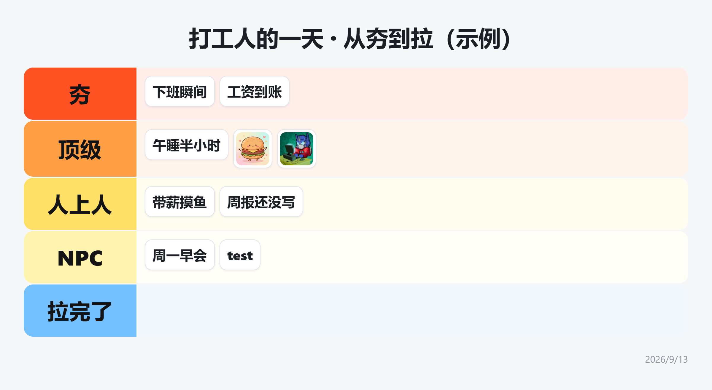
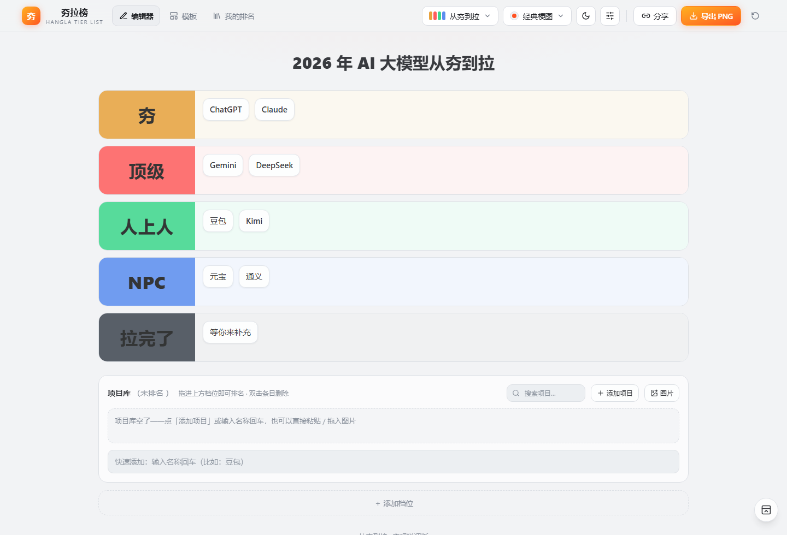
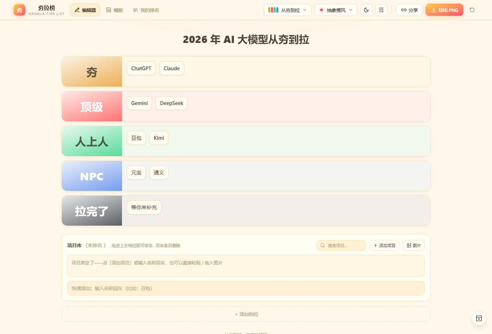
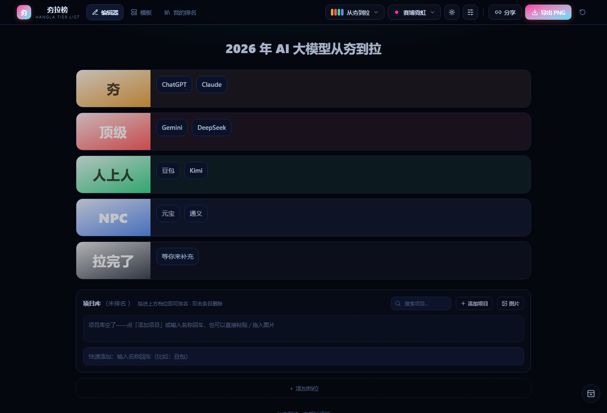
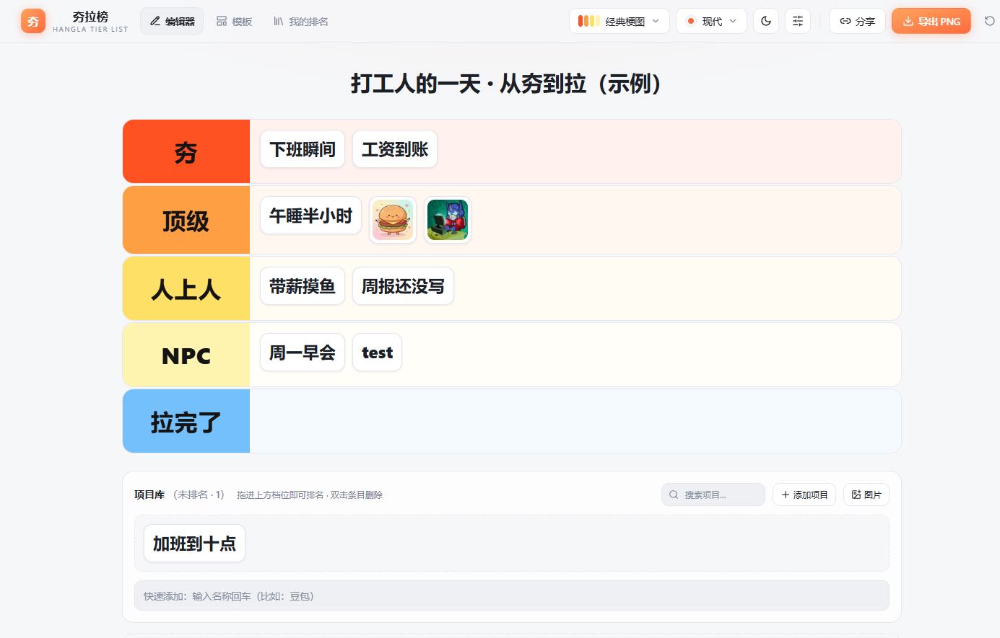

# 夯拉榜 (hangla)

[](https://react.dev)
[](https://www.typescriptlang.org)
[](https://vitejs.dev)
[](https://tailwindcss.com)
[](#许可证)

「从夯到拉」中文梗图 Tier List 排行榜生成器，支持拖拽排名、多风格昼夜切换、PNG 导出与一键分享

<!-- TODO: 待补在线 Demo 地址（vercel.json 已就绪，部署后把链接放在这一行） -->



```sh
git clone https://github.com/ChenChen913/hangla.git && cd hangla && npm install && npm run dev
```

## 特性

- **拖拽排榜**：跨档位拖动、档内实时换位；选中条目后点档位空位可快速归档
- **5 套评级模式**：从夯到拉 / 经典梗图 / SSR 稀有度 / 竞技梯度 T0-T4 / 经典 S ~ D，档位名、颜色、图标、描述都能改
- **4 种视觉风格 × 昼夜两套配色**（共 8 套主题）：现代 / 经典梗图 / 抽象梗风 / 赛博霓虹
- **高清 PNG 导出**：按 2 倍像素比渲染，文件名格式为 `<时间戳>-<榜单名>-排行榜.png`，时间戳精确到秒
- **分享链接**：整份榜单（含图片）编码进链接，对方打开即见同款，可一键复制回自己的编辑器
- **项目库**：未排名素材池，支持上传 Logo、写一句话描述、粘贴或拖入图片，图片自动压缩到最长边 640px
- **我的排名**：本机保存榜单快照，最多保留 30 份
- **全屏排版**：隐藏导航栏，直播 / 录屏时只留排行榜本身
- **单文件离线版**：`npm run build` 产出单个 `dist/index.html`，双击即可打开

同一条榜单换主题后的样子：

| 经典梗图 · 白天 | 抽象梗风 · 白天 | 赛博霓虹 · 黑夜 |
|:---:|:---:|:---:|
|  |  |  |

## 目录

- [特性](#特性)
- [背景](#背景)
- [快速开始](#快速开始)
- [用法](#用法)
- [配置](#配置)
- [项目结构](#项目结构)
- [开发](#开发)
- [FAQ](#faq)
- [如何贡献](#如何贡献)
- [许可证](#许可证)

## 背景

「从夯到拉」是中文互联网流行的分级梗：**夯**（封神、断层领先）＞ 顶级 ＞ 人上人 ＞ NPC ＞ **拉完了**（拉胯、垫底）。外网的 Tier List 文化很成熟，但缺少一套贴合中文梗语境、开箱即用的排行榜工具——夯拉榜就是为了补上这块：经典 Tier List 表格结构 + 中文互联网的档位语言，加上艺术字体和动效，让生成的排行榜可以直接当梗图发出去。

## 快速开始

前置要求：Node.js ≥ 20、Git。

```sh
git clone https://github.com/ChenChen913/hangla.git
cd hangla
npm install
npm run dev
```

打开终端输出的地址（默认 `http://localhost:5173`）即可使用。首次打开自带一份「2026 年 AI 大模型从夯到拉」示例榜单，直接拖着玩就行。

想要一个可以直接双击打开、发给他人的离线版本：

```sh
npm run build
```

构建产物为单文件 `dist/index.html`（样式、脚本、字体全部内联）。

## 用法

1. **加项目**：在「项目库」点「＋添加项目」（可传 Logo、写一句话描述），或在输入框敲名称回车，也可以直接粘贴 / 拖入图片
2. **排榜**：把项目卡拖进任意档位，跨档实时换位；选中项目后点档位空位可快速归档
3. **调档位**：点击档位名可改名、换色、加图标与描述、删除；「＋添加档位」自定义新档位
4. **换外观**：顶栏切换评级模式（从夯到拉 / 经典梗图 / SSR 稀有度 / 竞技梯度 T0-T4 / 经典 S ~ D）、视觉风格（现代 / 经典梗图 / 抽象梗风 / 赛博霓虹）、白天黑夜配色
5. **显示与样式**：滑杆图标面板里可调图片与名称的显隐、图片大小、歪着放（含每张图单独角度）、标签字体大小 / 字体 / 粗细、档位标签字体（标准 / 艺术得意黑）与动效强度
6. **导出 / 分享**：「导出 PNG」生成高清排行图（文件名带精确到秒的时间前缀，首屏那张就是导出结果）；「分享」复制榜单链接或下载分享卡片——对方打开链接看到同款排行榜，可一键复制来编辑
7. **全屏排版**：右下角圆形按钮隐藏导航栏，直播 / 录屏时只展示排行榜本身
8. **我的排名**：保存多个榜单快照，随时预览或恢复

编辑器的样子（右侧「项目库」里没排完的条目，可以直接拖进档位）：



## 配置

所有设置（外观、显示与样式、榜单内容）自动保存在浏览器 localStorage，**无需配置文件，也不读取任何环境变量**（`src/` 下没有 `import.meta.env` / `process.env` 的用法，不用建 `.env`）。

榜单存在 localStorage 的 `hangla.v3` 键下，上传的图片会先压缩再一并存入，因此单机可承载的图片数量受浏览器配额限制。

常用脚本：

| 命令 | 作用 |
|---|---|
| `npm run dev` | 启动开发服务器（默认 http://localhost:5173） |
| `npm run build` | 类型检查 + 打包单文件版到 `dist/index.html` |
| `npm run preview` | 本地预览构建产物 |
| `npm run docs:check` | 校验 README 站内锚点是否失效 |

评级模式内置 5 套（从夯到拉 / 经典梗图 / SSR 稀有度 / 竞技梯度 T0-T4 / 经典 S ~ D），档位颜色属于评级预设，在 `src/lib/presets.ts` 登记；视觉风格在 `src/lib/themes.ts` 登记（风格 × 日夜两维度，当前 4 风格 × 2 明暗 = 8 套）。

## 项目结构

```text
hangla/
├── index.html
├── vite.config.ts            # react + tailwindcss + viteSingleFile
├── vercel.json               # Vercel 部署配置
├── docs/                     # README 截图
├── scripts/
│   └── check-anchors.mjs     # README 锚点自检
├── src/
│   ├── main.tsx              # 入口：旧存档迁移、旧分享链接兼容
│   ├── App.tsx               # HashRouter + 路由切换动画
│   ├── index.css             # Tailwind 4 + 主题变量 + 字体
│   ├── types.ts              # 数据模型
│   ├── store/
│   │   ├── board.ts          # 榜单数据 / 操作 / 快照（persist → localStorage）
│   │   ├── toast.ts
│   │   └── ui.ts             # 弹层状态
│   ├── lib/
│   │   ├── themes.ts         # 风格 × 日夜主题（页面 + 导出配色）
│   │   ├── presets.ts        # 评级模式预设
│   │   ├── images.ts         # 图片读取与压缩
│   │   └── utils.ts          # 工具函数、分享编解码
│   ├── components/           # TierBoard / TierRow / ItemChip / 弹窗等
│   └── pages/                # EditorPage / PreviewPage / TemplatesPage / MinePage
└── legacy/                   # v0.2 纯 vanilla 版本留档
```

## 开发

```sh
npm run dev        # 开发服务器，改代码即时热更新
npm run build      # 类型检查 + 打包单文件版
npm run preview    # 预览构建产物
npm run docs:check # README 锚点自检
```

`npm install` 会通过 `prepare` 脚本装上 husky 的 Git 钩子：提交时由 `commitlint` 按 Conventional Commits 校验提交信息（`.husky/commit-msg`），改动 README 时 `pre-commit` 自动跑锚点检查。

提交规范见 [CONTRIBUTING.md](CONTRIBUTING.md)；面向 AI 会话的项目约定见 [AGENTS.md](AGENTS.md)；后续计划见 [ROADMAP.md](ROADMAP.md)。

## FAQ

**导出的 PNG 和编辑器里看到的不一样？**
不会——导出画布与编辑器使用同一套渲染参数（配色、阴影、间距、字体、歪斜角度全部同步）。若出现差异，刷新页面后重试。

**分享链接打不开或显示数据损坏？**
链接里编码了完整榜单（含图片），过长时个别应用会截断。请改用「下载 PNG」，或减少图片后重新分享。

**换浏览器后数据没了？**
数据按浏览器隔离存储在 localStorage。跨设备请使用「分享链接」，或在「我的排名」导出重要榜单。

**图片加多了会怎样？**
榜单（含图片）存在浏览器 localStorage，配额由浏览器决定。图片上传时已压缩到最长边 640px，但数量太多仍可能写满配额导致保存失败——重要榜单建议用「导出 PNG」或「我的排名」的快照留底。

**想长期保留多个榜单？**
用「我的排名」页的「保存快照」（本机最多 30 份），重要榜单建议同时导出 PNG 留底。

## 如何贡献

欢迎 Issue 和 Pull Request：

1. Fork 仓库并从 `main` 拉出分支
2. 提交信息遵循 Conventional Commits，摘要用简体中文并以中文开头（如 `feat: 新增XX功能`），钩子会自动校验
3. 每条提交只做一件事；`npm run build` 通过后再提交 PR
4. 新增视觉风格请同步更新 `themes.ts` 的页面配色与导出配色

提问与反馈请走 [Issues](https://github.com/ChenChen913/hangla/issues)，细则见 [CONTRIBUTING.md](CONTRIBUTING.md)。维护者：[@ChenChen913](https://github.com/ChenChen913)。

## 许可证

[MIT](LICENSE) © 2026 ChenChen913

界面里的「得意黑」字体（Smiley Sans）以 SIL Open Font License 1.1 授权，版权归听得 Antarctica & 摘星 Liu，详见 [THIRD-PARTY-NOTICES.md](THIRD-PARTY-NOTICES.md)。
