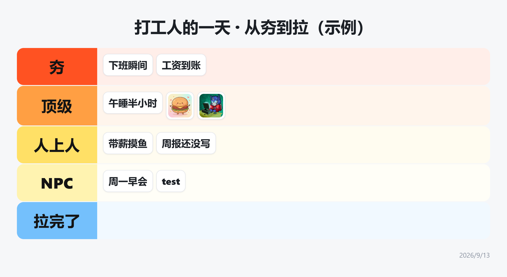
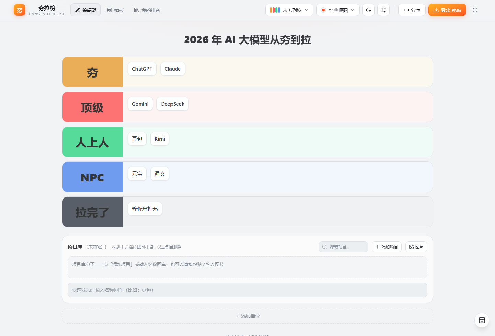
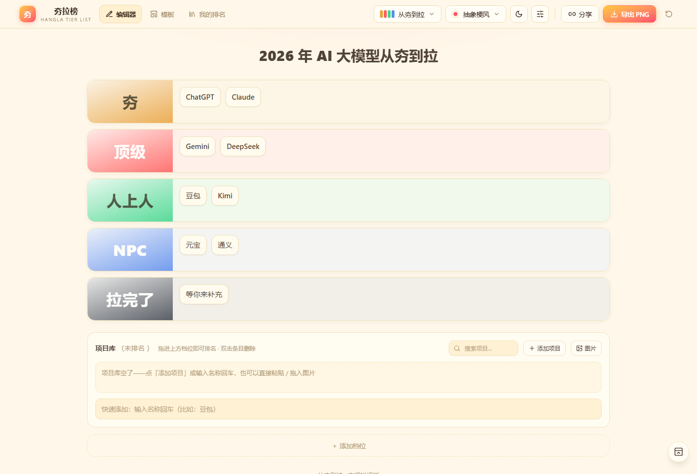
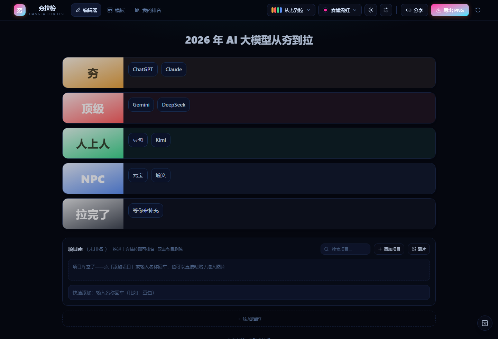
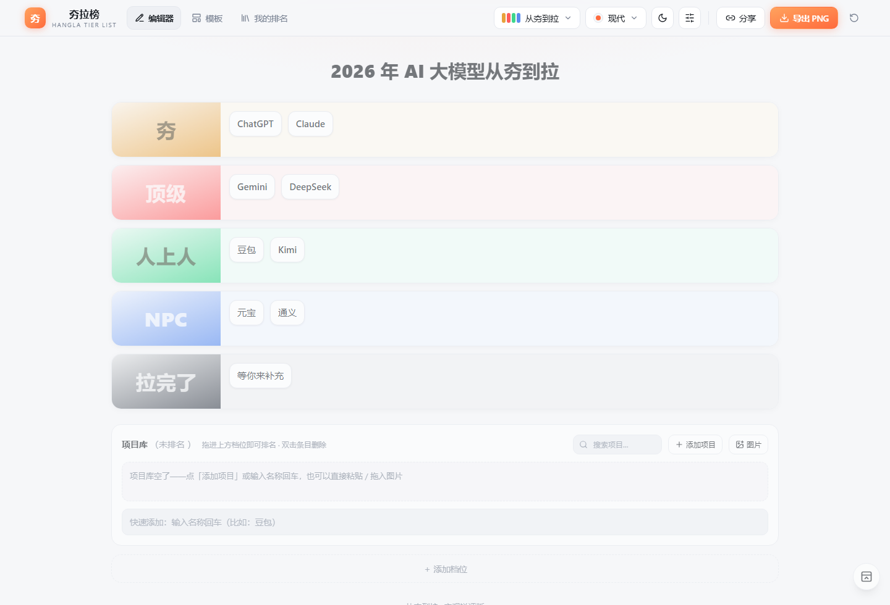

# 夯拉榜 (hangla)

[](https://react.dev)
[](https://www.typescriptlang.org)
[](https://vitejs.dev)
[](https://tailwindcss.com)
[](#许可证)
[](https://hangla-9bk.pages.dev/)

**简体中文** | [English](./README_EN.md)

「从夯到拉」中文梗图 Tier List 排行榜生成器，支持拖拽排名、多风格昼夜切换、PNG 导出与一键分享

**在线体验**：[hangla-9bk.pages.dev](https://hangla-9bk.pages.dev/)（Cloudflare Pages，主站） · [chenchen913.github.io/hangla](https://chenchen913.github.io/hangla/)（GitHub Pages，备用）—— 无需安装，直接打开网页版



```sh
git clone https://github.com/ChenChen913/hangla.git && cd hangla && npm install && npm run dev
```

## 特性

- **拖拽排榜**：跨档位拖动、档内实时换位
- **撤销 / 重做**：Ctrl+Z / Ctrl+Shift+Z（或顶栏那对箭头按钮）回退拖拽、增删档位、换风格等操作；标题这类逐字输入会合并成一步，不会一撤销就退掉一整段字
- **5 套评级模式**：从夯到拉 / 经典梗图 / SSR 稀有度 / 竞技梯度 T0-T4 / 经典 S ~ D，档位名与颜色可改，档位可增删
- **4 种视觉风格 × 昼夜两套配色**（共 8 套主题）：现代 / 经典梗图 / 抽象梗风 / 赛博霓虹
- **高清 PNG 导出**：按 2 倍像素比渲染，文件名格式为 `<时间戳>-<榜单名>-排行榜.png`，时间戳精确到秒
- **分享链接**：整份榜单（含图片）编码进链接，对方打开即见同款，可一键复制回自己的编辑器。注意图片是内联的——**一张压缩后的照片大约给链接增加 14 万字符**，远超微信 / QQ 能收的长度，所以弹窗会按实际字符数提示，长链接时把「下载 PNG」提到主按钮
- **手机端**：底部操作栏 + 44px 触控区；长按 0.2 秒拖拽，点卡片打开编辑抽屉；档位 / 条目的上移下移、换档、删除都不依赖拖拽；弹窗在手机上变成底部抽屉，适配安全区、动态视口与软键盘
- **项目库**：未排名素材池，支持上传 Logo、写一句话描述、粘贴或拖入图片；图片按内容重编码（照片转 JPEG、带透明的插画留 PNG），最长边 640px
- **我的排名**：本机保存榜单快照，最多保留 30 份；支持导出 / 导入 JSON 备份
- **全屏排版**：隐藏导航栏，直播 / 录屏时只留排行榜本身
- **单文件离线版**：`npm run build` 产出单个 `dist/index.html`，双击即可打开
- **网页部署版**：`npm run build:web` 产出 `dist-web/`（字体作为独立静态资源，首屏更小），由 GitHub Pages 在线托管

同一条榜单换主题后的样子：

| 经典梗图 · 白天 | 抽象梗风 · 白天 | 赛博霓虹 · 黑夜 |
|:---:|:---:|:---:|
|  |  |  |

## 目录

- [特性](#特性)
- [背景](#背景)
- [快速开始](#快速开始)
- [用法](#用法)
- [配置](#配置)
- [项目结构](#项目结构)
- [开发](#开发)
- [FAQ](#faq)
- [如何贡献](#如何贡献)
- [许可证](#许可证)

## 背景

「从夯到拉」是中文互联网流行的分级梗：**夯**（封神、断层领先）＞ 顶级 ＞ 人上人 ＞ NPC ＞ **拉完了**（拉胯、垫底）。外网的 Tier List 文化很成熟，但缺少一套贴合中文梗语境、开箱即用的排行榜工具——夯拉榜就是为了补上这块：经典 Tier List 表格结构 + 中文互联网的档位语言，加上艺术字体和动效，让生成的排行榜可以直接当梗图发出去。

## 快速开始

前置要求：Node.js ≥ 20、Git。

```sh
git clone https://github.com/ChenChen913/hangla.git
cd hangla
npm install
npm run dev
```

打开终端输出的地址（默认 `http://localhost:5173`）即可使用。首次打开自带一份「2026 年 AI 大模型从夯到拉」示例榜单，直接拖着玩就行。

想要一个可以直接双击打开、发给他人的离线版本：

```sh
npm run build
```

构建产物为单文件 `dist/index.html`（样式、脚本、字体全部内联）。

线上部署（GitHub Pages 或任意静态服务器）用网页版构建：

```sh
npm run build:web
```

产物在 `dist-web/`：字体不内联、作为独立静态资源按需加载，首屏更小；与 `npm run build` 的单文件离线版互不影响。

### 线上部署

| 平台 | 地址 | 发布方式 |
|---|---|---|
| Cloudflare Pages（主站） | https://hangla-9bk.pages.dev/ | `npm run deploy:cf`（Direct Upload） |
| GitHub Pages（备用） | https://chenchen913.github.io/hangla/ | push 到 `main` 后由 `deploy-pages.yml` 自动发布 |

Cloudflare 项目名是 `hangla`，但默认域名带 `-9bk` 后缀——`hangla.pages.dev` 已被别的站点占用，**不是本站**。Direct Upload 不会随 git push 自动更新，改完代码要重新执行 `npm run deploy:cf`；首次使用需先 `npx wrangler login`，或提供有 Pages:Edit 权限的 `CLOUDFLARE_API_TOKEN`。

## 用法

1. **加项目**：在「项目库」点「＋添加项目」（可传 Logo、写一句话描述），或在输入框敲名称回车，也可以直接粘贴 / 拖入图片
2. **排榜**：把项目卡拖进任意档位，跨档实时换位；拖错了按 `Ctrl+Z`（macOS 为 `⌘Z`）撤销，`Ctrl+Shift+Z` 重做
3. **调档位**：点击档位名可改名、换色、删除；「＋添加档位」自定义新档位
4. **换外观**：顶栏切换评级模式（从夯到拉 / 经典梗图 / SSR 稀有度 / 竞技梯度 T0-T4 / 经典 S ~ D）、视觉风格（现代 / 经典梗图 / 抽象梗风 / 赛博霓虹）、白天黑夜配色（手机上这些入口收在底部「设置」抽屉里）
5. **显示与样式**：滑杆图标面板里可调图片与名称的显隐、图片大小、歪着放（含每张图单独角度）、标签字体大小 / 字体 / 粗细、档位标签字体（标准 / 艺术得意黑）与动效强度
6. **导出 / 分享**：「导出 PNG」生成高清排行图（文件名带精确到秒的时间前缀，首屏那张就是导出结果）；「分享」复制榜单链接或下载分享卡片——对方打开链接看到同款排行榜，可一键复制来编辑
7. **全屏排版**：右下角圆形按钮隐藏导航栏，直播 / 录屏时只展示排行榜本身
8. **我的排名**：保存多个榜单快照，随时预览或恢复；也可导出 / 导入 JSON 做备份与迁移

编辑器的样子（右侧「项目库」里没排完的条目，可以直接拖进档位）：



## 配置

所有设置（外观、显示与样式、榜单内容）自动保存在浏览器 localStorage，**无需配置文件，也不读取任何环境变量**（`src/` 下没有 `import.meta.env` / `process.env` 的用法，不用建 `.env`）。

榜单和图片表存在 localStorage 的同一个 `hangla.v3` 键里：一次写入要么整份成功、要么整份失败，不会出现「正文已是新的、图片库还是旧的」这种版本错配。同一张图被多份快照引用时只存一份，删除项目后会自动回收；旧版的双键存档（`hangla.v3` + `hangla.v3::images`）仍然能读，首次保存后自动收敛成单键并清掉旧图片库。浏览器不允许写本地存储时（隐私模式 / 禁用站点数据），应用会退回内存运行，并在顶部常驻一条「刷新后会丢失」的提示。

单张照片重编码后约 80KB（同样尺寸不做处理时是 800KB 以上），实测浏览器配额（Chrome 约 5MB）大约能放六十多张。接近上限时会提示，写盘失败也会明确告诉你哪一步没保存下来，不会静默丢数据。

「显示与样式」（图片 / 名称显隐、歪斜、字号、字体、档位间距）是本机偏好，但会跟着**快照**和**分享链接**一起保存：别人打开链接看到的是你分享时的样子；恢复快照时也会一并恢复，撤销则只回退榜单内容、不回退这些设置。导入 JSON 只存为快照，不会覆盖正在编辑的榜单，导入文件上限 8MB。

常用脚本：

| 命令 | 作用 |
|---|---|
| `npm run dev` | 启动开发服务器（默认 http://localhost:5173） |
| `npm run build` | 类型检查 + 打包单文件版到 `dist/index.html` |
| `npm run build:web` | 类型检查 + 网页版构建到 `dist-web/`（字体独立，供 GitHub Pages） |
| `npm run preview` | 本地预览构建产物 |
| `npm run test` | 运行单元测试（vitest） |
| `npm run docs:check` | 校验两份 README 的站内锚点与双语一致性 |

评级模式内置 5 套（从夯到拉 / 经典梗图 / SSR 稀有度 / 竞技梯度 T0-T4 / 经典 S ~ D），档位颜色属于评级预设，在 `src/lib/presets.ts` 登记；视觉风格在 `src/lib/themes.ts` 登记（风格 × 日夜两维度，当前 4 风格 × 2 明暗 = 8 套）。

## 项目结构

```text
hangla/
├── .github/
│   ├── workflows/
│   │   ├── ci.yml            # CI：测试 + 文档校验 + 双构建
│   │   └── deploy-pages.yml  # push main 时发布 dist-web/ 到 GitHub Pages
│   └── PULL_REQUEST_TEMPLATE.md
├── index.html                # 入口 HTML（含 description / OG 等 meta）
├── vite.config.ts            # 双构建：默认单文件 dist/，--mode web 输出 dist-web/
├── vercel.json               # Vercel 部署配置
├── README_EN.md              # 英文版 README（与 README.md 镜像）
├── AGENTS.md                 # 面向 AI 会话的项目约定
├── CONTRIBUTING.md           # 贡献指南
├── ROADMAP.md                # 路线图
├── THIRD-PARTY-NOTICES.md    # 第三方字体授权
├── public/                   # 404.html / _headers / og-image.png（构建时原样复制）
├── docs/                     # README 截图、加固与移动端报告
├── scripts/
│   ├── check-anchors.mjs     # README 站内锚点自检
│   ├── check-i18n.mjs        # 中英 README 一致性校验
│   ├── check-facts.mjs       # 文档事实（数字 / 命令 / 链接）校验
│   ├── project-facts.json    # README 事实的唯一来源
│   ├── browser-check.mjs     # 真实 Chrome 回归（CDP，可选）
│   └── mobile-check.mjs      # 移动端 9 视图布局 + 触屏交互检查（CDP，可选）
├── src/
│   ├── main.tsx              # 入口：挂载 React、旧分享链接兼容
│   ├── App.tsx               # HashRouter + 路由切换动画
│   ├── index.css             # Tailwind 4 + 主题变量 + 字体
│   ├── types.ts              # 数据模型
│   ├── store/
│   │   ├── board.ts          # 榜单数据 / 操作 / 快照（persist → localStorage）
│   │   ├── board.test.ts     # 榜单操作测试
│   │   ├── toast.ts
│   │   └── ui.ts             # 弹层状态
│   ├── lib/
│   │   ├── themes.ts         # 风格 × 日夜主题（页面 + 导出配色）
│   │   ├── presets.ts        # 评级模式预设
│   │   ├── label.ts          # 档位标签配色（字色按实际底色挑，保证对比度）
│   │   ├── label.test.ts     # 全预设标签对比度测试
│   │   ├── history.ts        # 撤销 / 重做栈（内存态，合并连续输入）
│   │   ├── history.test.ts   # 撤销栈测试
│   │   ├── legacy.ts         # v2 旧存档迁移（存储不可用时安全跳过）
│   │   ├── legacy.test.ts    # 旧档迁移测试
│   │   ├── images.ts         # 图片读取、有限并发与重编码
│   │   ├── images.test.ts    # 批量图片调度测试
│   │   ├── exportNode.ts     # 屏幕外导出画布引用（导出 / 分享截图共用）
│   │   ├── drag.ts           # 拖拽排序辅助逻辑
│   │   ├── drag.test.ts      # 拖拽排序测试
│   │   ├── storage.ts        # 存档存储层（单 Key 原子写入、图片驻留去重、写失败兜底）
│   │   ├── storage.test.ts   # 存档故障注入测试
│   │   ├── share.ts          # 分享链接构造、体量估算与可用性判断
│   │   ├── share.test.ts     # 分享长度分级 / 编码上限测试
│   │   ├── utils.ts          # 工具函数、数据规范化、分享编解码
│   │   ├── utils.test.ts     # 数据边界 / 分享编解码 / FileReader 测试
│   │   └── facts.test.ts     # 文档事实 ↔ 代码常量校验
│   ├── components/           # TierBoard / TierRow / ItemChip / 弹窗等
│   └── pages/                # EditorPage / PreviewPage / TemplatesPage / MinePage
└── legacy/                   # v0.2 纯 vanilla 版本留档
```

## 开发

```sh
npm run dev        # 开发服务器，改代码即时热更新
npm run test       # 单元测试（数据边界 / 分享编解码 / 存档故障注入 / 图片批量 / 旧档迁移 / 文档事实）
npm run build      # 类型检查 + 打包单文件版
npm run build:web  # 类型检查 + 网页版构建（字体独立，部署用）
npm run preview    # 预览构建产物
npm run docs:check # README 锚点 + 双语一致性 + 事实数字校验
```

另有两份可选的浏览器检查脚本（需要本机装 Chrome，先 `npm run build:web` 生成 `dist-web/`）：

```sh
npm run browser:check   # 真实 Chrome：上传 / 拖拽 / 分享往返 / 快照恢复 / PNG 导出 / 移动端 / 存储降级
npm run mobile:check    # 9 种视口：横向溢出、触控目标、底部抽屉、长按拖拽、长文本、导出导入
```

`npm install` 会通过 `prepare` 脚本装上 husky 的 Git 钩子：提交时由 `commitlint` 按 Conventional Commits 校验提交信息（`.husky/commit-msg`），改动 README 时 `pre-commit` 会跑完整的 `npm run docs:check`（站内锚点 + 双语一致性）。

提交规范见 [CONTRIBUTING.md](CONTRIBUTING.md)；面向 AI 会话的项目约定见 [AGENTS.md](AGENTS.md)；后续计划见 [ROADMAP.md](ROADMAP.md)。

## FAQ

**导出的 PNG 和编辑器里看到的不一样？**
不会——导出画布与编辑器使用同一套渲染参数（配色、阴影、间距、字体、歪斜角度全部同步）。若出现差异，刷新页面后重试。

**分享链接打不开或显示数据损坏？**
链接里编码了完整榜单（含图片），过长时个别应用会截断。换算一下：一张 640px 照片压缩后约 80KB，进 data URL 再整体编码，**编进链接大约 14 万字符**——而聊天软件能正常收发的一般只有几千字符。所以**只要榜单里有图，就请用「下载 PNG」**；链接这条路是给纯文字榜单准备的。弹窗会显示当前链接的字符数，超过 8000 字符时把「下载 PNG」提为主按钮。

**换浏览器后数据没了？**
数据按浏览器隔离存储在 localStorage。跨设备请使用「分享链接」，或在「我的排名」导出重要榜单。

**手机上怎么拖拽 / 调整顺序？**
长按卡片约 0.2 秒再拖动；也可以直接点卡片打开编辑抽屉，用「上移 / 下移 / 移到上一档 / 移到下一档」按钮。档位顺序在点档位名打开的弹窗里调。手指落下后直接滑动是滚动页面，不会误拖卡片。

**分享链接会带上我的显示设置吗？**
会。链接里编码了分享那一刻的显示与样式（图片 / 名称显隐、歪斜、字号、字体、档位间距），接收者打开看到的就是你分享时的样子；「复制一份来编辑」也会应用这套设置。快照同理：预览、恢复都按保存时的设置还原，只有「撤销」不会回退外观。

**图片加多了会怎样？**
图片存在浏览器 localStorage，配额由浏览器决定（Chrome 约 5MB，实测能放六十多张照片）。写满时会弹提示告诉你没保存成功，此时删掉几张图片即可恢复——重要榜单建议先用「导出 PNG」留底。

**为什么有两个构建产物？**
`npm run build` 产出单文件 `dist/index.html`（样式、脚本、字体全部内联，双击即用，适合离线分发）；`npm run build:web` 产出 `dist-web/` 常规多文件站点（字体作为独立静态资源，首屏更小，适合在线部署）。上方的在线 Demo 用的是后者，由 GitHub Pages 工作流自动发布。

**想长期保留多个榜单？**
用「我的排名」页的「保存快照」（本机最多 30 份），重要榜单建议同时导出 PNG 留底。

## 如何贡献

欢迎 Issue 和 Pull Request：

1. Fork 仓库并从 `main` 拉出分支
2. 提交信息遵循 Conventional Commits，摘要用简体中文并以中文开头（如 `feat: 新增XX功能`），钩子会自动校验
3. 每条提交只做一件事；`npm test`、`npm run build` 与 `npm run build:web` 通过后再提交 PR（CI 会跑同样的检查）
4. 新增视觉风格请同步更新 `themes.ts` 的页面配色与导出配色

提问与反馈请走 [Issues](https://github.com/ChenChen913/hangla/issues)，细则见 [CONTRIBUTING.md](CONTRIBUTING.md)。维护者：[@ChenChen913](https://github.com/ChenChen913)。

## 许可证

[MIT](LICENSE) © 2026 ChenChen913

界面里的「得意黑」字体（Smiley Sans）以 SIL Open Font License 1.1 授权，版权归听得 Antarctica & 摘星 Liu，详见 [THIRD-PARTY-NOTICES.md](THIRD-PARTY-NOTICES.md)。
